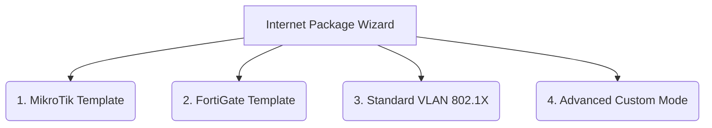

# คู่มือการใช้งาน RADIUS Attributes และ Internet Packages (Profiles)

เอกสารฉบับนี้อธิบายถึงความเข้าใจ โครงสร้างข้อมูล และความสัมพันธ์ระหว่าง **RADIUS Attributes** และ **Internet Packages (หรือ Profiles)** ที่ถูกใช้งานในระบบจัดการ FreeRADIUS Multi-Tenant (SaaS Edition) 

---

## 1. แนวคิดพื้นฐาน (Basic Concepts)

### 1.1 RADIUS Attribute คืออะไร?
RADIUS Attributes คือชุดตัวแปร (Variables) และค่าข้อมูล (Values) ที่ใช้ส่งไปมาในขั้นตอนการส่งผ่านข้อมูลเครือข่ายระหว่าง **NAS (Network Access Server เช่น Router/Firewall)** และ **RADIUS Server (FreeRADIUS)** เพื่อใช้ในการระบุตัวตน (Authentication), อนุมัติสิทธิ์ (Authorization) และเก็บข้อมูลการใช้งาน (Accounting)

ใน FreeRADIUS จะแบ่งประเภทการตรวจสอบออกเป็น 2 ประเภทหลัก:
1. **Check Attributes (ใช้ตรวจสอบเงื่อนไขขาเข้า):** เก็บข้อมูลในตาราง `radgroupcheck` และ `radcheck` เป็นตัวแปรที่ใช้ตรวจสอบว่าผู้ใช้งานหรือกลุ่มผู้ใช้งานมีสิทธิ์เข้าเชื่อมต่อหรือไม่ ภายใต้ข้อจำกัดที่ระบุไว้ เช่น
   - **Simultaneous-Use (:=):** จำกัดจำนวนอุปกรณ์ที่ล็อกอินพร้อมกัน
   - **Session-Timeout (:=):** จำกัดชั่วโมงการเชื่อมต่อของเซสชัน (วินาที)
2. **Reply Attributes (ส่งค่าตอบกลับเพื่อควบคุมฝั่งอุปกรณ์):** เก็บข้อมูลในตาราง `radgroupreply` และ `radreply` เป็นตัวแปรที่ RADIUS Server จะส่งกลับไปให้กับ Router/Firewall หลังจากการยืนยันตัวตนสำเร็จ เพื่อให้เครือข่ายปลายทางควบคุมผู้ใช้รายนั้นๆ เช่น
   - **Mikrotik-Rate-Limit (=):** บีบความเร็วผู้ใช้งานบน MikroTik
   - **Fortinet-Group-Name (=):** ส่งชื่อกลุ่มไปจับคู่กับ Policy/Traffic Shaper บน FortiGate
   - **Tunnel-Private-Group-Id (=):** ส่งหมายเลข VLAN ID ไปบังคับใช้บนอุปกรณ์ Enterprise

---

## 2. โครงสร้างและการทำงานของ Internet Packages (Profiles)

ในระบบนี้ **Internet Package** (หรือ Profile) จะเทียบเท่ากับ **Group** บน FreeRADIUS 
ความสัมพันธ์ของข้อมูลแบบ Multi-Tenancy จะถูกแยกออกจากกันโดยใช้ `tenant_id` และชื่อของโปรไฟล์ (Groupname) 

### 2.1 โครงสร้างบน Database (PostgreSQL)

เมื่อสร้างหรืออัปเดต Package ข้อมูลจะถูกบันทึกลงในตารางหลักสองตารางของ FreeRADIUS โดยแยกตามประเภท Attribute:

* **ตาราง `radgroupcheck`:**
  - `tenant_id`: รหัสลูกค้าผู้เช่า
  - `groupname`: ชื่อโปรไฟล์ (Package Name)
  - `attribute`: ชื่อ Attribute (เช่น `Simultaneous-Use`, `Session-Timeout`)
  - `op`: โอเปอเรเตอร์ที่ใช้ตรวจสอบ (เช่น `:=`)
  - `value`: ค่าที่ใช้ตรวจ (เช่น `5`, `86400`)

* **ตาราง `radgroupreply`:**
  - `tenant_id`: รหัสลูกค้าผู้เช่า
  - `groupname`: ชื่อโปรไฟล์ (Package Name)
  - `attribute`: ชื่อ Attribute (เช่น `Mikrotik-Rate-Limit`, `Fortinet-Group-Name`, `Class`)
  - `op`: โอเปอเรเตอร์ (เช่น `=`)
  - `value`: ค่าที่จะส่งกลับไปควบคุม (เช่น `10M/10M`, `VIP-Group`)

> [!IMPORTANT]
> **ระบบป้องกันข้อมูลสูญหาย (Class Marker)**
> FreeRADIUS ทำงานโดยอ้างอิงว่าหาก Group ไม่มี Attribute ใดๆ อยู่ในตารางเลย ระบบจะไม่ถือว่ามีกลุ่มนั้นอยู่ (โปรไฟล์จะหายไปจากฐานข้อมูล) 
> เพื่อป้องกันปัญหานี้ ทุกครั้งที่มีการสร้างหรือแก้ไขโปรไฟล์ ระบบจะบันทึก Attribute พิเศษที่ชื่อว่า `Class` (Value เป็นชื่อ Group) ลงในตาราง `radgroupreply` เสมอ เพื่อเป็นตัวค้ำให้โปรไฟล์ยังคงอยู่ในระบบแม้ว่าผู้ใช้งานจะไม่เลือกจำกัดสิทธิ์ใดๆ เลยก็ตาม

---

## 3. รูปแบบเทมเพลตแพ็กเกจ (Package Templates) ทั้ง 4 โหมด

ในการสร้าง Internet Package ระบบได้จัดเตรียมหน้ากากฟอร์ม (Wizard) ไว้ทั้งหมด 4 รูปแบบตามประเภทอุปกรณ์และการทำงาน:



---

### 1) MikroTik Template (📶 Bandwidth Control)
ออกแบบมาสำหรับจัดเก็บข้อมูลและประยุกต์ใช้งานร่วมกับ MikroTik RouterOS (เช่น Hotspot หรือ PPPoE) เป็นหลัก

* **Attributes ที่เกี่ยวข้อง:**
  - **`Mikrotik-Rate-Limit`** (Reply Attribute, Op: `=`)
    - ค่าใน DB: รูปแบบ `Upload/Download` (เช่น `10M/10M`, `5M/20M` ในหน่วย Mbps)
    - การทำงาน: MikroTik จะรับค่านี่แล้วไปสร้าง Simple Queue ให้อัตโนมัติทันทีที่ผู้ใช้งานล็อกอินสำเร็จ
  - **`Simultaneous-Use`** (Check Attribute, Op: `:=`)
    - สำหรับระบุโควต้าอุปกรณ์ล็อกอินพร้อมกัน
  - **`Session-Timeout`** (Check Attribute, Op: `:=`)
    - จำกัดเวลาการเชื่อมต่อต่อเซสชัน

---

### 2) FortiGate Template (🛡️ Traffic Shaper)
เหมาะสำหรับการใช้งานร่วมกับ FortiGate Firewall ในโหมด Captive Portal หรือการตรวจสอบสิทธิ์ระดับกลุ่มผู้ใช้

* **ทำไมจึงใช้ FortiGate Template แยกออกมา?**
  - FortiGate ไม่ได้ควบคุมความเร็วด้วย Attribute บีบเน็ตแบบรายตัวตรงๆ เช่น `Mikrotik-Rate-Limit`
  - แต่จะใช้แนวคิดส่งชื่อกลุ่ม (**Fortinet-Group-Name**) กลับไปที่ FortiGate จากนั้นตัว Firewall จะนำชื่อกลุ่มนี้ไปผูกกับกฎความเร็ว (Traffic Shaper) และนโยบายการควบคุม (Security Policy) ที่ฝั่งเครื่อง FortiGate เอง
* **Attributes ที่เกี่ยวข้อง:**
  - **`Fortinet-Group-Name`** (Reply Attribute, Op: `=`)
    - ค่าใน DB: ชื่อกลุ่มที่แอดมินกำหนดในระบบ (เช่น `VIP-Group`, `Staff-Group`)
  - **ขั้นตอนการทำงาน:**
    1. ผู้ใช้งานล็อกอินสำเร็จผ่าน Captive Portal
    2. FreeRADIUS ส่งค่า `Fortinet-Group-Name = "VIP-Group"` ไปยัง FortiGate
    3. FortiGate จะจัดผู้ใช้งานรายนั้นลงไปอยู่ในกลุ่มความปลอดภัยที่กำหนดไว้บนตัวอุปกรณ์ไฟร์วอลล์ทันที

---

### 3) Standard Enterprise Template (🏷️ 802.1X VLAN)
ใช้สำหรับจัดสรร VLAN ให้กับผู้ใช้งานในระดับองค์กร (WPA2/WPA3 Enterprise หรือ Wired 802.1X) ใช้ได้กับอุปกรณ์หลากยี่ห้อ (Cisco, Aruba, Ruckus, FortiGate, MikroTik)

* **Attributes ที่เกี่ยวข้อง (RFC Standard):**
  - **`Tunnel-Type`** (Reply Attribute, Op: `=`, Value: `VLAN`)
    - แจ้งให้อุปกรณ์ปลายทางทราบว่าจะสลับทราฟฟิกเข้าสู่ระดับ VLAN
  - **`Tunnel-Medium-Type`** (Reply Attribute, Op: `=`, Value: `IEEE-802`)
    - แจ้งชนิดการเชื่อมต่อมาตรฐาน 802
  - **`Tunnel-Private-Group-Id`** (Reply Attribute, Op: `=`, Value: `<VLAN ID>`)
    - ตัวระบุหมายเลข VLAN ID (เช่น `100`, `200`) ที่ต้องการให้อุปกรณ์บังคับส่งทราฟฟิกของผู้ใช้เข้าสู่โครงข่ายนั้นๆ

---

### 4) Advanced Custom Mode (⚙️ Custom Attributes)
โหมดขั้นสูงสำหรับผู้ดูแลระบบโครงข่ายเครือข่าย เพื่อเพิ่มตัวแปร RADIUS พิเศษที่ไม่เข้าพวกกับเทมเพลตมาตรฐานทั่วไป รองรับการพิมพ์ค้นหาจาก RADIUS Dictionary ที่ลงทะเบียนไว้

* **โครงสร้างการเพิ่ม Attribute ไดนามิก:**
  - แอดมินสามารถระบุ **Attribute Name**, **Operator**, **Value** และ **Type** (Check/Reply) ด้วยตนเองได้โดยไม่มีข้อจำกัด
  - เช่น การป้อน Attribute ของยี่ห้ออื่นๆ ที่ระบบไม่ได้ทำหน้ากากสำเร็จรูปไว้ให้โดยเฉพาะ

---

## 4. ตารางเปรียบเทียบโอเปอเรเตอร์ (RADIUS Operators Cheat Sheet)

โอเปอเรเตอร์จะควบคุมวิธีการนำข้อมูลในฐานข้อมูลไปประมวลผลเปรียบเทียบกับทราฟฟิกที่ขออนุมัติ:

| Operator | ความหมาย | รูปแบบการใช้งานในระบบ |
| :---: | :--- | :--- |
| `=` | **Equals (Reply)** | กำหนดค่าตัวแปรส่งกลับไปหาตัวรับ (เช่น ส่ง `VLAN ID = 10` ไปให้ Switch) |
| `:=` | **Assign (Check)** | บังคับตั้งค่าเงื่อนไขการตรวจสอบขานั้นทันที หากมีค่านี้ in DB จะนำค่านี่มาเช็กเป็นหลัก |
| `==` | **Comparison** | ใช้เปรียบเทียบค่าว่าตรงกันหรือไม่เพื่อยืนยันสิทธิ์ |
| `+=` | **Add** | นำค่าตัวแปรนี้บวกเพิ่มเข้าไปในรายการ (ใช้กับรายการที่มีการส่งค่าซ้ำๆ ได้ เช่น DNS Server) |

---

## 5. การตั้งค่าฝั่งผู้เช่า (Tenant Checklist)

เพื่อให้แพ็กเกจทำงานร่วมกับอุปกรณ์จริงได้อย่างราบรื่น แอดมินสามารถนำข้อมูลนี้ไปอ้างอิง:

1. **กรณีใช้ MikroTik (Hotspot/PPPoE):**
   - ตรวจสอบว่าใน `/ip hotspot profile` ได้ทำการเปิดใช้การยืนยันตัวตนแบบ **RADIUS** เรียกว่าการเรียกใช้ RADIUS Client แล้ว
   - ตรวจสอบว่ารหัสเชื่อมต่อ (Radius Shared Secret) ตรงกัน
2. **กรณีใช้ FortiGate (Traffic Shaper/User Group):**
   - สร้าง User Group บน FortiGate ให้มีชนิดเป็น **Firewall** และเลือก Remote Authentication Server เป็น RADIUS ที่เราติดตั้งไว้
   - ในการตั้งค่า RADIUS บน FortiGate ต้องแน่ใจว่าได้ระบุ Vendor Code เป็น `Fortinet (12356)` เพื่อรองรับการอ่านค่า `Fortinet-Group-Name` ได้ถูกต้อง
3. **กรณีใช้ VLAN Assignment:**
   - มั่นใจว่าสวิตช์หรือ AP ที่รับค่าได้ถูกจัดทำ (Trunk / Tagged) หมายเลข VLAN ปลายทางเอาไว้รองรับแล้ว มิเช่นนั้น อุปกรณ์อาจปฏิเสธการเชื่อมต่อของผู้ใช้ได้ (VLAN Fail)

---

## 6. ระบบลงทะเบียนสมาชิกใหม่และการจัดการอุปกรณ์ (Self-Registration & Device Type Integration)

เพื่อรองรับระบบสมัครสมาชิกด้วยตนเองของผู้ใช้งาน (Self-Registration) บนหน้าเว็บล็อกอิน (Captive Portal) โดยคำนึงถึงประเภทอุปกรณ์ที่ต่างกันของผู้เช่า (Tenant) ระบบได้รับการออกแบบสถาปัตยกรรมข้อมูลดังนี้:

### 6.1 การทำงานของ Default Register Profile
* **RADIUS Group Mapping:** เมื่อผู้ใช้ลงทะเบียนสำเร็จ บัญชีผู้ใช้นั้นจะถูกจับคู่กับโปรไฟล์เริ่มต้นที่บันทึกอยู่ในตาราง `radusergroup` 
* **เมนูตั้งค่าสำหรับผู้เช่า:** Tenant Admin สามารถกำหนดตัวเลือกนี้ผ่านหน้าจอ **"ตั้งค่า Captive Portal" -> Registration Settings** ซึ่งจะมี Dropdown ให้แอดมินเลือกโปรไฟล์เริ่มต้นจากความสามารถ/ความเร็วที่สร้างเตรียมไว้ได้อิสระ
* **สิทธิ์การลบ (Delete Protection):** ระบบป้องกันไม่ให้แอดมินกดลบโปรไฟล์อินเทอร์เน็ตที่ถูกผูกเป็น Default Register Profile อยู่ในขณะนั้น เพื่อป้องกันปัญหาโครงสร้างข้อมูลผู้ลงทะเบียนใหม่ขัดข้อง (ปุ่มลบจะแสดงข้อความแจ้งเตือนและระงับการกด)

### 6.2 การกำหนดค่าเริ่มต้นเมื่อสร้าง Tenant (Auto-Provisioning)
เมื่อ Super Admin ทำการสร้าง Tenant ใหม่ และเลือก **Primary Device Type** (ประเภทอุปกรณ์หลักของลูกค้า):
* ระบบจะทำการสร้างโปรไฟล์เริ่มต้นที่เข้ากันได้กับอุปกรณ์นั้นให้อัตโนมัติ (เช่น สร้าง `Default-Mikrotik` สำหรับผู้ใช้ที่เลือก MikroTik หรือสร้าง `Default-Fortigate` สำหรับผู้ใช้ที่เลือก FortiGate)
* ระบบจะสลับโปรไฟล์เริ่มต้นที่ระบบเพิ่งทำแบบอัตโนมัตินั้นให้เป็น Default Register Profile ของผู้เช่ารายใหม่พร้อมใช้งานทันที

### 6.3 พฤติกรรมเมื่อมีการสลับค่ายอุปกรณ์ (Device Type Migration)
ในกรณีที่ Tenant Admin หรือ Super Admin เข้ามาแก้ไขประเภทอุปกรณ์หลักของ Tenant ภายหลัง (เช่น เปลี่ยนประเภทจาก **MikroTik ➡️ FortiGate**):

1. **Auto-Switch UI Focus:** 
   - ปุ่มหรือแท็บเริ่มต้นเมื่อกดบันทึกหรือเพิ่มโปรไฟล์ใหม่ (Add Package Wizard) จะสลับไปโฟกัสที่ค่ายใหม่โดยอัตโนมัติ (เช่น สลับแท็บเริ่มทำงานเป็น FortiGate) แต่ยังคงแสดงทุกแท็บค่ายอุปกรณ์ไว้เพื่อไม่สูญเสียความยืดหยุ่นในกรณี Multi-Vendor
2. **Unlock Old Profile:** 
   - โปรไฟล์ดีฟอลต์เก่า (เช่น `Default-Mikrotik`) จะหลุดออกจากการถูกผูกเป็น Default และปลดล็อกสิทธิ์ให้แอดมินสามารถลบออกได้
3. **Data Migration Workflow (แจ้งเตือนย้ายกลุ่มผู้ใช้เก่า):**
   - เมื่อกดบันทึกเปลี่ยนค่าย ระบบจะแสดง Popup ยืนยันว่าต้องการย้ายผู้ใช้งานเดิมที่เคยลงทะเบียนผ่านกลุ่มของอุปกรณ์เก่ามายังค่ายใหม่ด้วยหรือไม่
   - หากตกลง ระบบหลังบ้านจะสั่งรันคำสั่ง SQL ย้ายผู้ใช้งานข้ามกลุ่มในครั้งเดียว เพื่อป้องกันผู้ใช้อินเทอร์เน็ตเดิมใช้งานไม่ได้หลังเปลี่ยนอุปกรณ์:
     ```sql
     UPDATE radusergroup 
     SET groupname = 'Default-Fortigate' 
     WHERE groupname = 'Default-Mikrotik' AND tenant_id = 'target_tenant_id';
     ```
