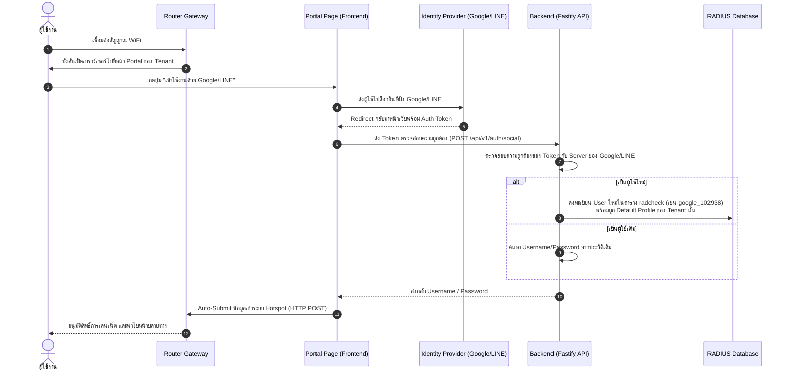

# คู่มือการออกแบบหน้าสมัครสมาชิก (Self-Registration) และระบบลงชื่อเข้าใช้ผ่านโซเชียล (External/Social Login)

เอกสารฉบับนี้อธิบายรายละเอียดเกี่ยวกับสถาปัตยกรรม, โครงสร้างฐานข้อมูล, ลำดับการทำงาน (Workflow) และการตั้งค่าของหน้าระบบลงทะเบียนและเข้าใช้งานอินเทอร์เน็ตสำหรับผู้ใช้งานทั่วไป (Captive Portal / Hotspot) ในระดับ Multi-Tenant

---

## 1. ภาพรวมสถาปัตยกรรม (Architectural Overview)
ระบบออกออกแบบมาให้แต่ละผู้เช่า (Tenant) สามารถปรับแต่งหน้าลงชื่อเข้าใช้ (Captive Portal) และหน้าลงทะเบียน (Self-Registration) เพื่อสอดคล้องกับภาพลักษณ์องค์กรหรือแบรนด์ของตนเอง โดยมีคุณสมบัติดังนี้:
*   **Tenant Branding**: กำหนดโลโก้, ชื่อองค์กร, ข้อตกลงการใช้งาน (Terms of Service) และหมายเหตุแยกจากกันในแต่ละ Tenant
*   **Identity Provider (IdP) Integration**: รองรับการระบุตัวตนด้วยเครือข่ายโซเชียลมีเดียที่ไม่มีค่าใช้จ่ายแอบแฝง
*   **Auto-Registration**: ลงทะเบียนผู้ใช้อัตโนมัติลงในฐานข้อมูล FreeRADIUS เมื่อตรวจสอบสิทธิ์ผ่าน IdP สำเร็จ

---

## 2. การออกแบบฐานข้อมูล (Database Schema)

เพื่อบันทึกการตั้งค่าหน้าล็อกอินและสมัครสมาชิกเฉพาะตัวของแต่ละผู้เช่า จะใช้โครงสร้างตาราง **`tenant_portal_settings`** ดังต่อไปนี้:

```sql
CREATE TABLE tenant_portal_settings (
    tenant_id UUID PRIMARY KEY REFERENCES tenants(id) ON DELETE CASCADE,
    org_name VARCHAR(255) NOT NULL,
    logo_url VARCHAR(500),
    terms_of_service TEXT,
    footer_note TEXT,
    is_register_enabled BOOLEAN NOT NULL DEFAULT TRUE,
    is_social_login_enabled BOOLEAN NOT NULL DEFAULT TRUE,
    theme_color VARCHAR(10) NOT NULL DEFAULT '#3b82f6', -- รหัสสี HEX สำหรับปุ่มและธีมหน้านั้นๆ
    created_at TIMESTAMP NOT NULL DEFAULT NOW(),
    updated_at TIMESTAMP NOT NULL DEFAULT NOW()
);
```

---

## 3. ผู้ให้บริการ Social Login ที่แนะนำ (ไม่มีค่าบริการ/Free Providers)

เพื่อให้ระบบเป็นไปตามแนวทางไม่มีค่าใช้จ่ายแอบแฝง ระบบจึงแนะนำการเชื่อมต่อกับผู้ให้บริการหลัก 2 รายดังนี้:

| ผู้ให้บริการ | เทคโนโลยีหลัก | ข้อดีสำหรับผู้ใช้ชาวไทย | นโยบายค่าบริการ |
| :--- | :--- | :--- | :--- |
| **Google** | OAuth 2.0 / OpenID Connect | ปลอดภัยสูง, ทุกคนมี Gmail ผูกติดกับสมาร์ทโฟน | **ฟรี 100%** สำหรับการยืนยันตัวตนพื้นฐาน |
| **LINE** | LINE Login v2.1 | ได้รับความนิยมสูงสุดในไทย, สามารถทำ **Auto-Login** หากเปิดลิงก์ในแอป LINE | **ฟรี 100%** สำหรับการลงทะเบียนรับข้อมูลโปรไฟล์ทั่วไป |

> [!WARNING]
> **สำคัญมากเรื่อง Walled Garden (Bypass List):**
> ก่อนที่อุปกรณ์ของผู้ใช้จะได้รับสิทธิ์เข้าอินเทอร์เน็ต (Authenticated) อุปกรณ์ตัวส่งสัญญาณ (Router/NAS) จะต้องกำหนดค่า Walled Garden เพื่ออนุญาตให้อุปกรณ์สื่อสารกับ Server ของ Google และ LINE ได้ก่อน มิฉะนั้นผู้ใช้จะไม่สามารถโหลดหน้าล็อกอินหรือกรอกข้อมูลยืนยันตัวตนได้
> *   **Google IPs/Domains ที่ต้องปลดล็อก:** `accounts.google.com`, `ssl.gstatic.com`, `*.googleusercontent.com`
> *   **LINE Domains ที่ต้องปลดล็อก:** `access.line.me`, `api.line.me`

---

## 4. ลำดับการทำงาน (Workflows)

### 4.1 การลงชื่อเข้าใช้ผ่านโซเชียล (Social Login Flow)
กระบวนการยืนยันตัวตนผ่าน Google/LINE และเชื่อมต่อ FreeRADIUS:



---

### 4.2 ระบบลงทะเบียนสมาชิกด้วยตัวเอง (Self-Registration Flow)
กรณีที่ไซต์เปิดใช้งาน `is_register_enabled` ผู้ใช้ทั่วไปจะสามารถสมัครใช้งานได้ด้วยขั้นตอนดังนี้:

1.  **เข้าหน้าลงทะเบียน**: ผู้ใช้งานกดปุ่ม "สมัครสมาชิก" บนหน้า Captive Portal
2.  **กรอกข้อมูลหลัก**: กรอกฟิลด์ข้อมูลที่กำหนด เช่น ชื่อ-นามสกุล, เบอร์โทรศัพท์, อีเมล และตั้งรหัสผ่านเอง
3.  **ยอมรับเงื่อนไข (TOS)**: ผู้ใช้งานต้องกดเครื่องหมายถูกยอมรับ **Terms of Service** ก่อนส่งแบบฟอร์ม
4.  **ตรวจสอบและจัดเก็บข้อมูล**:
    *   ระบบตรวจสอบสิทธิ์ป้องกันการสมัคร Username ซ้ำในตาราง `radcheck`
    *   บันทึกบัญชีลงตาราง `radcheck` (ข้อมูลยืนยันตัวตน)
    *   เพิ่มบัญชีลงตาราง `radusergroup` โดยกำหนดกลุ่มเป็นค่า `default_register_profile` ของ Tenant นั้นๆ อัตโนมัติ
5.  **ล็อกอิน**: หน้าเว็บจะทำ Auto-Login นำบัญชีที่สมัครเข้าสวมสิทธิ์ผ่านหน้า Hotspot ในทันที

---

## 5. การบังคับใช้กฎหมาย พ.ร.บ. คอมพิวเตอร์ (Log & Identity Matching)
เพื่อให้ระบบเป็นไปตามพระราชบัญญัติว่าด้วยการกระทำความผิดเกี่ยวกับคอมพิวเตอร์ (ฉบับแก้ไขเพิ่มเติม):
1.  **การระบุตัวตน (Identity Verification)**: การลงทะเบียนผ่าน Google/LINE หรือกรอกข้อมูลด้วยตนเอง จะทำการเก็บประวัติ Log เอาไว้ในฐานข้อมูลเพื่อเชื่อมโยง IP/MAC Address ณ ขณะที่ล็อกอิน เข้ากับข้อมูลอีเมลหรือชื่อจริงของผู้ใช้จริง
2.  **การเก็บ Logs**: ล็อกการเข้าใช้งานจากอุปกรณ์ NAS (เก็บผ่าน `radacct`) ร่วมกับ Log การเข้าเว็บ (เก็บใน Loki ผ่าน Vector) จะนำมาทำแผนที่เชื่อมโยงกับ Username เสมอ ทำให้เจ้าหน้าที่สามารถย้อนหาตัวบุคคลผู้กระทำผิดได้ย้อนหลังอย่างน้อย 90 วัน
