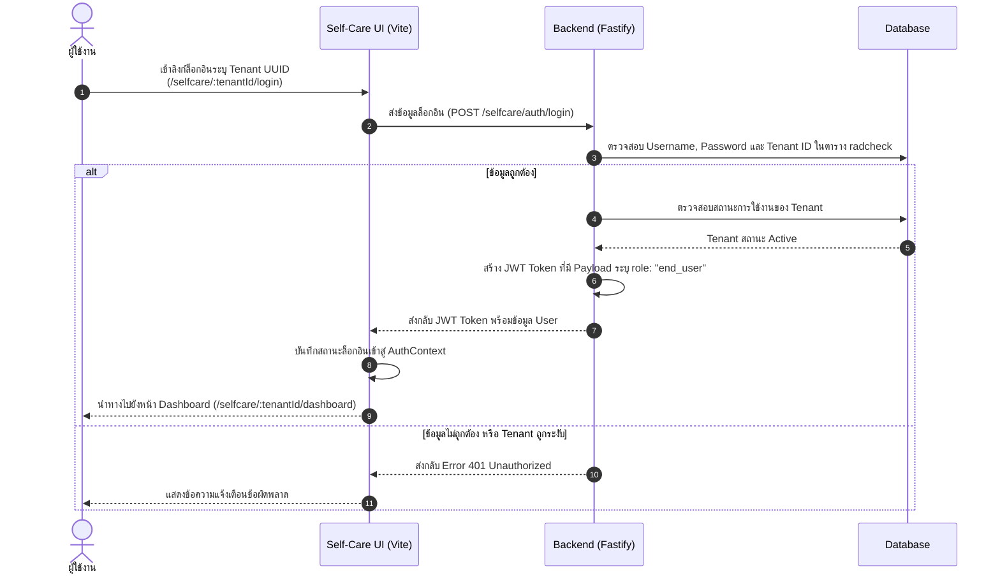
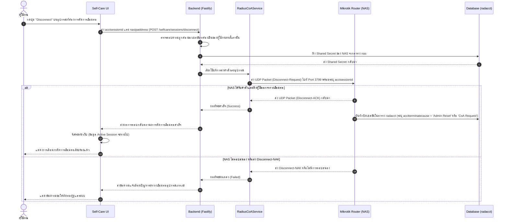

# คู่มือระบบพอร์ทัลจัดการตนเองของผู้ใช้งานอินเทอร์เน็ต (End-User Self-Care Portal)

เอกสารฉบับนี้อธิบายรายละเอียดเกี่ยวกับสถาปัตยกรรม, โครงสร้างข้อมูลการเชื่อมโยง, ลำดับการทำงาน (Workflow) และการทำงานของระบบตัดเซสชันการเชื่อมต่อของตนเอง (RADIUS CoA / Self-Disconnect) ในระบบพอร์ทัลจัดการตนเองสำหรับผู้ใช้งานทั่วไป (Self-Care Portal) ภายใต้สถาปัตยกรรม Multi-Tenant

---

## 1. ภาพรวมสถาปัตยกรรม (Architectural Overview)
ระบบออกออกแบบมาเพื่อลดภาระงานดูแลระบบของแอดมิน โดยเปิดให้ผู้ใช้งานอินเทอร์เน็ต (End-User) สามารถล็อกอินเข้ามาจัดการบัญชีและสิทธิ์การใช้งานอินเทอร์เน็ตของตนเองได้แบบเรียลไทม์ โดยรองรับคุณสมบัติดังนี้:
*   **Tenant Isolation**: ผู้ใช้งานจะเข้าสู่ระบบผ่านลิงก์ล็อกอินที่ระบุ ID ของ Tenant เช่น `/selfcare/:tenantId/login` ทำให้ระบบดึงเฉพาะข้อมูลบัญชีผู้ใช้งานและจำกัดสิทธิ์การทำงานอยู่ภายใต้ Tenant ของตนเองเท่านั้น
*   **Real-time Quota Monitoring**: แสดงผลการใช้งานอินเทอร์เน็ต ทั้งข้อมูลดาวน์โหลด/อัปโหลด (Data Quota) และระยะเวลาการใช้งาน (Time Quota) เปรียบเทียบกับข้อจำกัดในแพ็กเกจของผู้ใช้ในรูปแบบแถบความคืบหน้า (Progress Bar)
*   **RADIUS CoA integration**: การส่งคำสั่งยกเลิกการเชื่อมต่อของอุปกรณ์ (Disconnect-Request) ไปยัง Mikrotik NAS ทันทีเมื่อผู้ใช้งานกดปุ่ม "Disconnect" จากหน้าเว็บ

---

## 2. การเชื่อมโยงโครงสร้างข้อมูล (Database Relations)

ระบบ Self-Care Portal จะทำงานร่วมกับตารางในฐานข้อมูล FreeRADIUS และตาราง SaaS หลักดังต่อไปนี้:

*   **`radcheck`**: ตรวจสอบบัญชีผู้ใช้งาน (Username) และรหัสผ่าน (`Cleartext-Password`) ที่จับคู่กับ `tenantId` (UUID) ของผู้เช่าที่กำลังเรียกใช้
*   **`radusergroup`**: ตรวจสอบแพ็กเกจ/กลุ่มโปรไฟล์ (เช่น `10Mbps_30Days`) ที่ถูกกำหนดให้กับผู้ใช้งาน เพื่อใช้นำทางไปหาข้อจำกัดอินเทอร์เน็ต
*   **`radgroupcheck` / `radgroupreply`**: ใช้ดึงค่าจำกัดโควต้า เช่น `Max-All-Octets` (ปริมาณข้อมูลสูงสุด) หรือ `Max-All-Session` (เวลาใช้งานสูงสุด) มาคำนวณและแสดงผลโควต้าคงเหลือ
*   **`radacct`**: ตรวจสอบสถานะการเชื่อมต่อปัจจุบัน (Session ที่มี `acctstoptime IS NULL` คืออุปกรณ์ที่กำลัง Online อยู่) รวมถึงประวัติการเชื่อมต่อย้อนหลังของผู้ใช้

---

## 3. ลำดับการทำงาน (Workflows)

### 3.1 ระบบยืนยันตัวตนและการเข้าถึงสิทธิ์ (Self-Care Authentication Workflow)

---

### 3.2 ระบบเตะอุปกรณ์ของตนเองออก (Self-Disconnect / RADIUS CoA Workflow)

เมื่อเกิดปัญหาเซสชันค้าง (เช่น ผู้ใช้ปิดการรับสัญญาณ Wi-Fi โดยไม่ได้ล็อกเอาต์) ทำให้อุปกรณ์ชิ้นใหม่ไม่สามารถล็อกอินได้เนื่องจากติดเงื่อนไขการล็อกอินซ้อน ผู้ใช้งานสามารถกดปุ่ม "Disconnect" จากหน้าเว็บเพื่อสั่งตัดการเชื่อมต่อเซสชันเดิมผ่าน RADIUS CoA ได้ดังนี้:

---

### 3.3 ระบบการแก้ไขรหัสผ่านผู้ใช้งาน (Change Password Workflow)

1.  **การเรียกใช้งาน**: ผู้ใช้ไปที่หน้าเปลี่ยนรหัสผ่านกรอก "รหัสผ่านเดิม" และ "รหัสผ่านใหม่"
2.  **การตรวจสอบหลังบ้าน**:
    *   Backend ค้นหาข้อมูล `Cleartext-Password` ของผู้ใช้งานคนปัจจุบันในตาราง `radcheck` ภายใต้ `tenantId`
    *   หากรหัสผ่านเดิมถูกต้อง ระบบจะทำการเขียนทับรหัสผ่านใหม่ในตาราง `radcheck` ที่ฟิลด์ `value`
3.  **ผลกระทบการเชื่อมต่อ**: การเชื่อมต่ออินเทอร์เน็ตที่เชื่อมต่ออยู่ก่อนหน้าจะยังไม่ถูกตัดออกทันที แต่การล็อกอินเข้าใช้งานใหม่ในครั้งถัดไปจะต้องใช้รหัสผ่านใหม่ที่เพิ่งตั้งค่าทันที

---

## 4. ความปลอดภัยและการจำกัดขอบเขตการเข้าถึงข้อมูล (Security & Isolation)

เพื่อรับรองว่าผู้ใช้งานทั่วไป (End-User) จะเข้าถึงได้เฉพาะข้อมูลส่วนตัวและไม่สร้างช่องโหว่ความปลอดภัยให้กับระบบ ระบบได้วางมาตรการควบคุมดังนี้:

*   **Role Enforcement**: ในไฟล์ `ProtectedRoute` ของ Frontend และ Hook การตรวจสอบ JWT ใน Backend จะกรองเฉพาะบัญชีที่มี `role: "end_user"` เท่านั้น จึงจะสามารถเรียกใช้งานหน้าเว็บและ API ภายใต้กลุ่มของตนเองได้
*   **Enforced Query Criteria**: ในทุก ๆ Query ที่เรียกประวัติการเชื่อมต่อ (`radacct`) หรือจัดการข้อมูลผู้ใช้ จะต้องระบุเงื่อนไขการกรอง (Where Clause) ด้วย `tenantId` และ `username` เสมอ เพื่อป้องกันปัญหาการเข้าถึงบัญชีของผู้อื่น (Horizontal Privilege Escalation)
*   **Port Constraints for CoA**: ตัวเซิร์ฟเวอร์ส่งสัญญาณ CoA ถูกจำกัดสิทธิ์ให้ติดต่อสื่อสารเฉพาะไปยัง IP Address ของ NAS ที่ลงทะเบียนอยู่ในตาราง `nas` เท่านั้น
